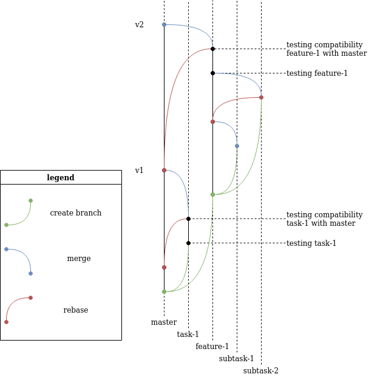
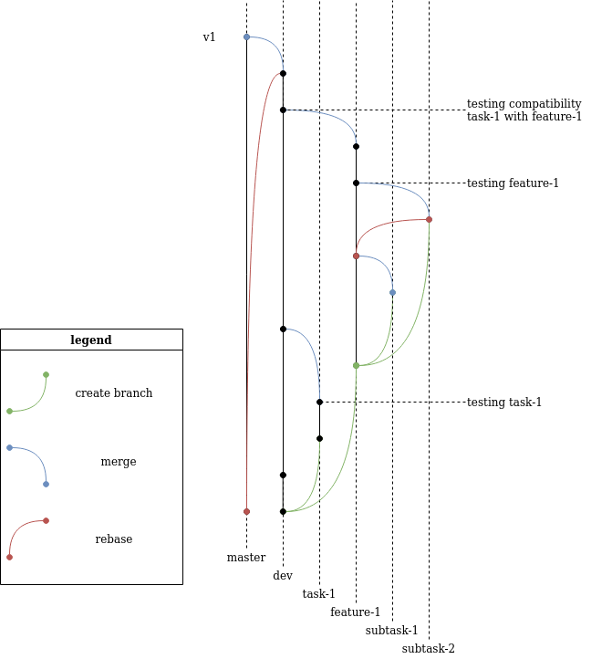

# README #

Этот проект описывает различные git workflow, плюсы и минусы.
И, возможно сравнительную таблицу

### Для кого этот репозиторий? ###

* Для разработчиков
* Для Product Owners
* etc

### 1. Релиз по задачам ###
Ветки:
- **master**
На каждую задачу создаётся отдельная ветка.
Тест проводится прямо в этой ветке, после сливается в мастер.

Плюсы:
+ Самый простой подход
+ Быстрая поставка продукта

Минусы: 
- Для каждой задачи приходится делать полное тестирование всего функционала, что занимает очень много времени тестировщика если конечно нет автотестов

Что если у нас 2 тестировщика? и один тестирует task-1 а другой feature-1 в одно и то же время? 
В таком случае после ребейза и до окончания тестирования нельзя тестировать другие задачи (нет смысла)?
Второй тестировщик будет отдыхать? 
В 1 схеме нет решений - второму тестировщику предстоит или помогать первому, или найти чем заняться другим. 
Поэтому мы приходим к схеме 2:

### 2. Периодический релиз ###
Ветки:
- **master** (в которой стоит production сервер) 
- **dev** - в ней проводится тестирование на совместимость. 

Плюсы: 
+ тестирование всего функционала сводится к минимуму. 
+ если нет автотестов - тестирование всего функционала можно проводить 1 раз перед релизом.

Минусы:
- более долгая поставка продукта (чем 1)
- Невозможность выкинуть задачу из релиза если она была слита
Конечно это возможно, revert и прочее, но не рекомендуется так делать. 

Чем опасно: 
- При тестах на совместимость может повылезать много багов.

### 3. Периодический релиз для нескольких команд ###
Ветки: 
- **master**
- **release-1**
- **release-2**

...

